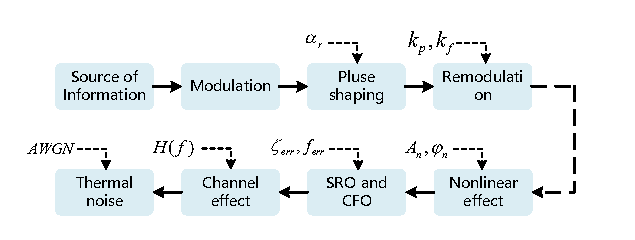
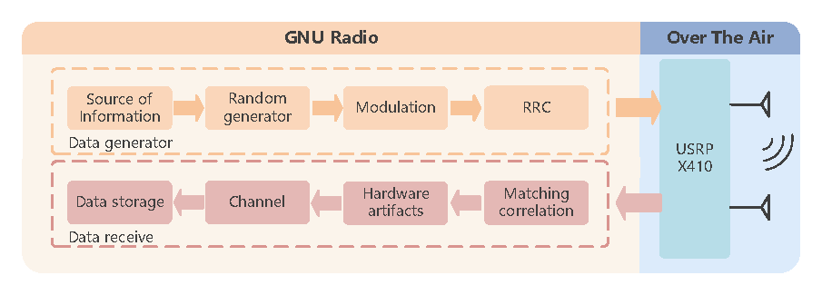
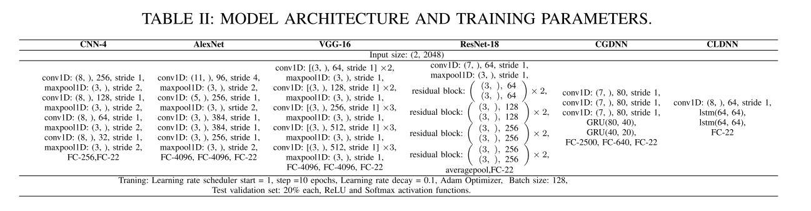
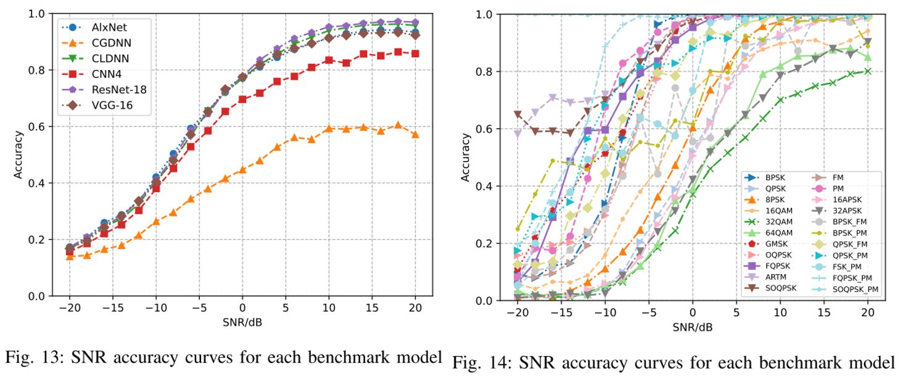
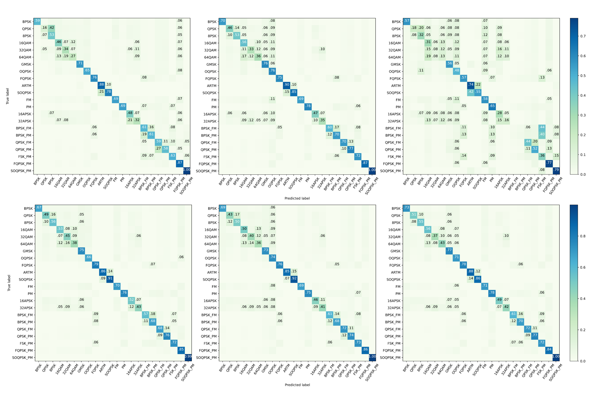

#   RML24-Satellite Cognitive Radio Using SDR
​
***RML24 Dataset download [link](https://terabox.com/s/1uT2uewv2kcMEjgjlTTimBw): https://terabox.com/s/1uT2uewv2kcMEjgjlTTimBw***

RML24 is the first dataset designed specifically for deep learning applications in satellite signal identification and demodulation. RML24 integrates telemetry and communication signals in Telemetry, Tracking, and Command (TT & C) systems and simulates the effects of signal impairments in real satellite channels. The dataset utilizes a software-defined radio (SDR) platform and radio frequency (RF) transceivers to perform rigorous over-the-air measurements and validate the collected data. RML24 provides researchers with fundamental data and modeling benchmarks for widely used modulation classification models in the hope of facilitating the algorithmic validation and development of intelligent and adaptive satellite communication systems and advancing the development of datadriven satellite communication technologies. 
## Dataset Generation Approach
###### RML24 Modeling Process：

###### RML24 Data Generation Process：

## RML24 AMR Baseline
###### MODEL  ARCHITECTURE AND TRANING PARAMETERS:

###### Baseline:
 

## Dataset Usage Instructions

 - Modulation schemes (22 types): 
• Single Modulation: BPSK, QPSK, OQPSK, SOQPSK-TG, FQPSK, ARTM, FM, PM, 8PSK, GMSK, 16QAM, 32QAM, 64QAM, 16APSK, 32APSK.
• Composite Modulation: PCM-BPSK-PM, PCM-QPSK-PM, PCM-SOQPSK-PM, PCM-FQPSK-PM, PCM-BPSK-FM, PCM-QPSK-FM, PCM-2FSK-PM.
 - SNR: -20dB - 20dB.
 - Label: IQ data, Bit data, Mod. class, Code rate, SNR. 
 - Sample rate：1MHz.
 - Sample length： 2048.

## Detailed Description
The related work for this dataset is presented in the preprint paper titled [Cognitive Radio for Satellite TT & C System: A General Dataset Using Software-defined Radio (RML24).](https://www.techrxiv.org/users/860233/articles/1243118-cognitive-radio-for-satellite-tt-c-system-a-general-dataset-using-software-defined-radio-rml24) The paper provides detailed information on the data generation process. The specific generation code is still being organized, and it is expected to be officially open-sourced after the paper has been revised and published.

